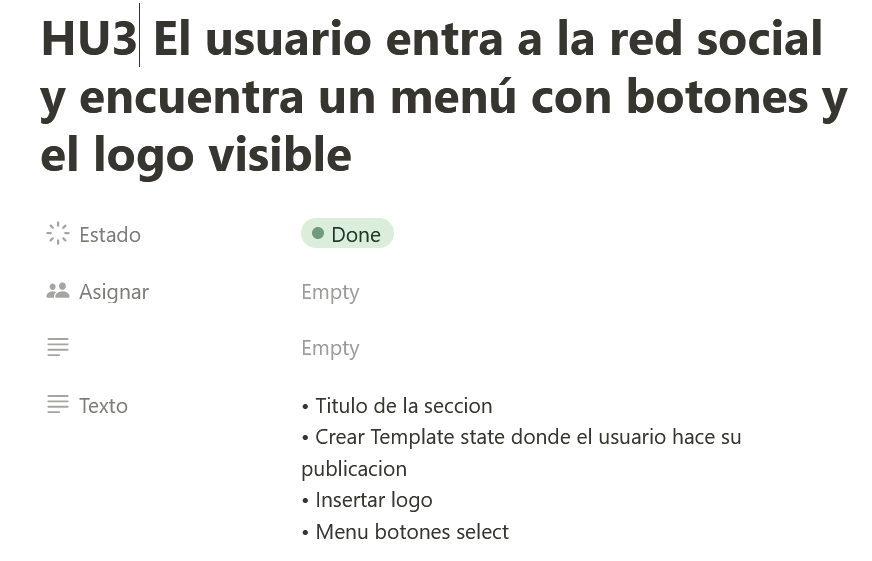

# THE BIKE COMMUNITY  “Red de mujeres ciclistas”

## Índice

* [1. Introducción](#1-introduccion)
* [2. Resumen del proyecto](#2-resumen-del-proyecto)
* [3. Historias de Usuario](#1-historias-de-usuario)

## 1. Introducción

THE BIKE COMMUNITY  “Red de Mujeres Ciclistas” es un proyecto que nació con la idea de proporcionar un ambiente seguro para una comunidad de mujeres que buscan conocer a otras mujeres ciclistas. Esta red social aspira a entender las posibles necesidades en crear redes de apoyo y compañía para mujeres durante sus recorridos en bicicleta. 

## 2. Resumen del proyecto

Para poder hacernos una idea de cómo comenzar a estructurar nuestro concepto de red social, decidimos realizar un cuestionario donde, a partir de este, le preguntamos a nuestras posibles usuarias, diferentes preguntas en relación a lo que les gustaría en contrar en este proyecto. Nuestra muestra estadística consistió en 45 respuestas.

A continuación, las respuestas obtenidas:

A partir de las respuestas recibidas, identificamos que para las posibles usuarias encuestadas, lo que más les interesaba encontrar en esta Red Social es poder entablar amistad con otras mujeres, más que la posibilidad de inscribirse en un sitio donde puedan adquirir conocimientos de ciclismo. Por esta misma razón, decidimos poner énfasis en el aspecto de conectar con otras usuarias entre sí, en lugar de ser una fuente de información.

Con una idea ya más clara del propósito de nuestro proyecto, comenzamos a diseñar los respectivos prototipos de baja y alta fidelidad.

Aquí nuestros prototipos de baja fidelidad:

Y a continuación nuestros prototipos de alta fidelidad:

Después de considerar diferentes opciones y pruebas, nos decidimos con el siguiente prototipo como nuestra versión final.

### 3. Historias de Usuario

